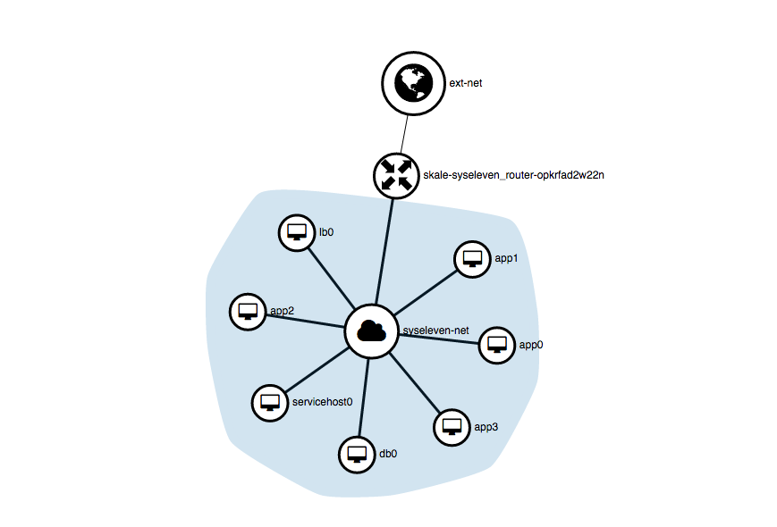

# Event collection and analysis

**Distributed Elasticsearch based log cluster to store your event data. Equipped with monitoring, trending and self healing capabilities.**

## Overview

With this example we demonstrate a so called ELK-Service on demand:

- a load balancer
- an elasticsearch backend consisting of three servers.
- a dashboard to analyze your logs
- Prometheus installed on every node to collect statistics
- Prometheus Alert Manager to react on failures and events (provide eslf healing capabilities for example).



These servers are provisioned only with cloud-init/ shell scripts. For service discovery we use consul.

- Any node installs consul via cloud-init/ a simple shell script.

Every service has service checks announced to the whole cluster.

## How to start this setup

- add your public SSH key to `clustersetup-env.yaml`
- Start the setup:

```shell
openstack stack create -t clustersetup.yaml -e clustersetup-env.yaml <stack_name>
```

## After successful stack creation you can connect to these endpoints:

1. Kibana to view log events

2. Prometheus to view cluster health (time series data)

3. Consul to view actual cluster state 

